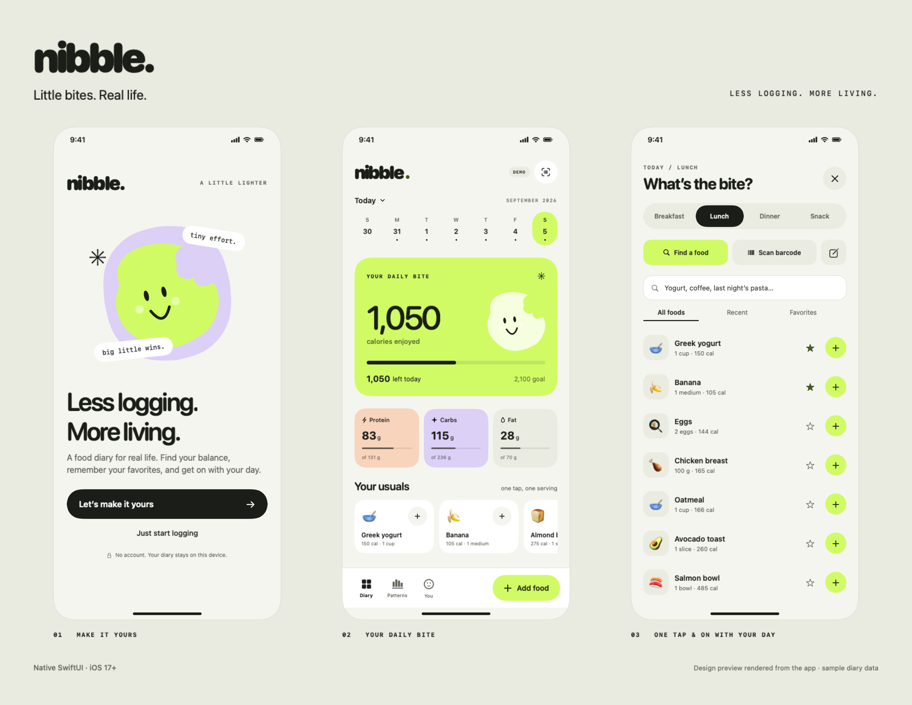

# nibble.

**Little bites. Real life.** A native SwiftUI food diary for iPhone, redesigned around fast, forgiving calorie tracking.



## The experience

- **Start immediately.** Track without a target, bring an existing target, or estimate one using age, height, weight, activity, and direction. Metric and imperial units are supported.
- **Your usuals, one tap away.** Quick-add a serving, revisit recent foods, or star your favorites.
- **Scan the package.** Camera scanning and typed GTIN barcodes use Open Food Facts, with gram/milliliter portions, explicit errors, and manual label entry when data is incomplete.
- **Make a food.** Save your own label or recipe estimate. Calories alone are enough; unknown macros stay visibly incomplete.
- **Fix a little slip.** Edit portions and meals, delete entries through their menu, or undo your last diary change.
- **See the bigger picture.** A date picker and seven-day strip open past diary days; Patterns shows logged days and an average that excludes missing days.
- **A little personality.** An original SwiftUI bite mascot, lime/lilac/peach palette, oversized calorie card, custom icon, and a springy mascot interaction with reduced-motion support.

Search covers the starter library and your saved foods. Barcode lookup accesses the external product database. Generic meals are labeled as estimates.

## Run on iPhone

Open **Nibble.xcodeproj** in Xcode 26 or later (required for current App Store uploads). Select the **Nibble** scheme and an iPhone simulator running iOS 17 or later, then Run. For a physical iPhone, choose your development team in Signing & Capabilities. Camera scanning needs a physical device; typed lookup works in the simulator.

The original `com.caloriecompass.app` bundle identifier and source directory are retained for continuity. The product, scheme, icon, and display name are Nibble.

## Try the native design preview on this Mac

```sh
bash Tools/preview.sh
```

This compiles the shared SwiftUI app as a phone-sized macOS preview using Command Line Tools. It opens with **DEMO** sample data stored only in memory. It does not change the real diary. The scanner displays a device-camera explanation in the Mac preview.

```sh
bash Tools/render.sh
```

Regenerates the actual SwiftUI screen previews, design board, and opaque 1024 px icon. The previews include an illustrative phone status bar; they are **not iOS Simulator screenshots**.

## Verify

```sh
bash Tools/check.sh
```

Checks project metadata, shared SwiftUI code, diary/storage behavior, nutrition arithmetic, and barcode decoding/HTTP failures. Executable tests need no third-party dependencies.

Optional live network check:

```sh
swiftc -swift-version 5 CalorieCompass/Models.swift CalorieCompass/OpenFoodFactsClient.swift Tools/CheckLiveBarcode.swift -o .build/live-barcode
.build/live-barcode 3017620422003
```

The [GitHub Actions workflow](https://github.com/bond-is-here/nibble/actions/workflows/ios.yml) runs on a standard macOS 26 runner and checks for an iOS 26+ SDK, runs the test suite, and builds both the iPhone Simulator Debug and unsigned iPhone Release configurations. The initial app passed all of these checks in [run 34000992086](https://github.com/bond-is-here/nibble/actions/runs/34000992086). This is build validation, not on-device UI/camera testing or a signed distributable build. The local machine currently lacks full Xcode and the iPhone SDK.

## App Store preparation

- [Privacy policy](PRIVACY.md) and [support](SUPPORT.md), also linked inside the app
- [Draft App Store listing and review notes](AppStore/metadata.md)
- [Release checklist and account/signing prerequisites](AppStore/release-checklist.md)

No purchase, enrollment, signed upload, or App Store submission has been performed. The current bundle identifier must be available in the owner's Apple developer team before registration. A free Apple account supports limited personal-device testing; App Store distribution requires an active Apple Developer Program membership or an approved fee waiver.

## Data and estimates

`AppState` saves a versioned JSON archive under Application Support/Nibble using atomic writes. In-memory state changes only after saving succeeds. Earlier Calorie Compass profiles, entries, and saved foods are imported from existing UserDefaults keys, which are retained. Unreadable archives are preserved and surfaced as a storage error.

No account, analytics, or cloud sync is included. Barcode lookup sends the barcode to Open Food Facts; the diary and body profile are not uploaded. The app includes a privacy manifest for its own UserDefaults access.

Calorie estimates use [Mifflin–St Jeor](https://pubmed.ncbi.nlm.nih.gov/2305711/) with common activity factors and a modest directional adjustment. Nibble's 1,500-calorie floor is an application guardrail, not a clinical minimum. Macro targets use a transparent 25/45/30 energy split. The estimate flow is limited to adults and describes its limitations, consistent with [NIDDK's adult planning guidance](https://www.niddk.nih.gov/health-information/weight-management/body-weight-planner).

Product nutrition is attributed to [Open Food Facts](https://world.openfoodfacts.org/), whose database is available under [ODbL](https://world.openfoodfacts.org/terms-of-use). Missing or malformed macros are never silently treated as known zeroes. Saved barcode results can be used offline.
